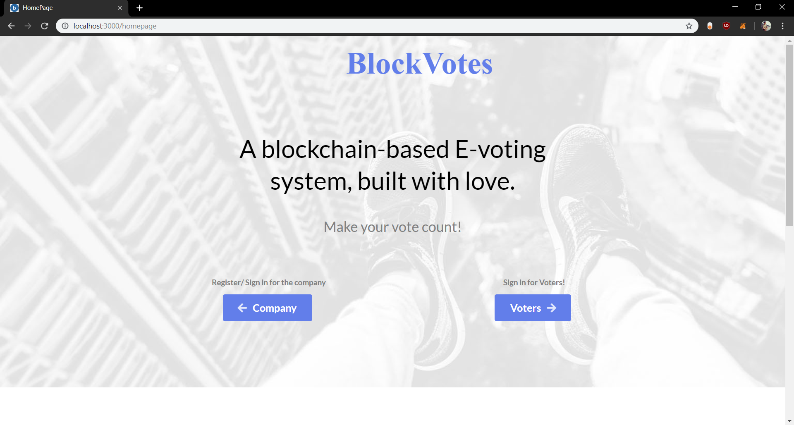
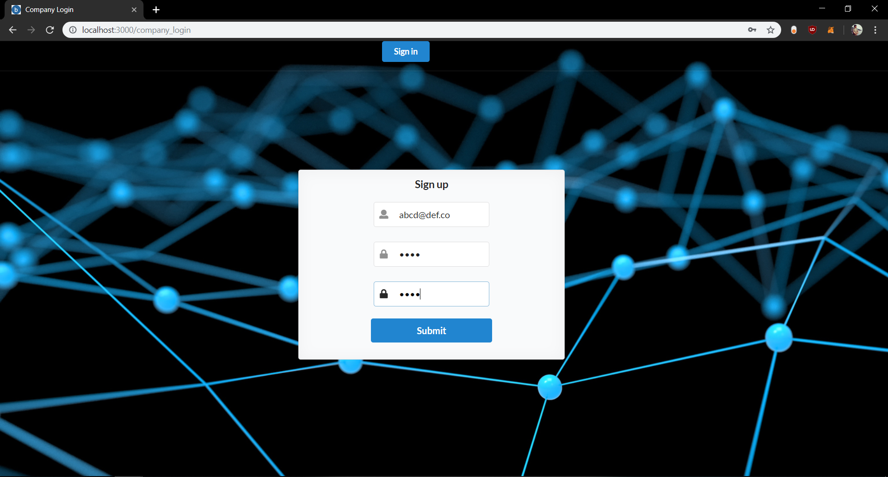
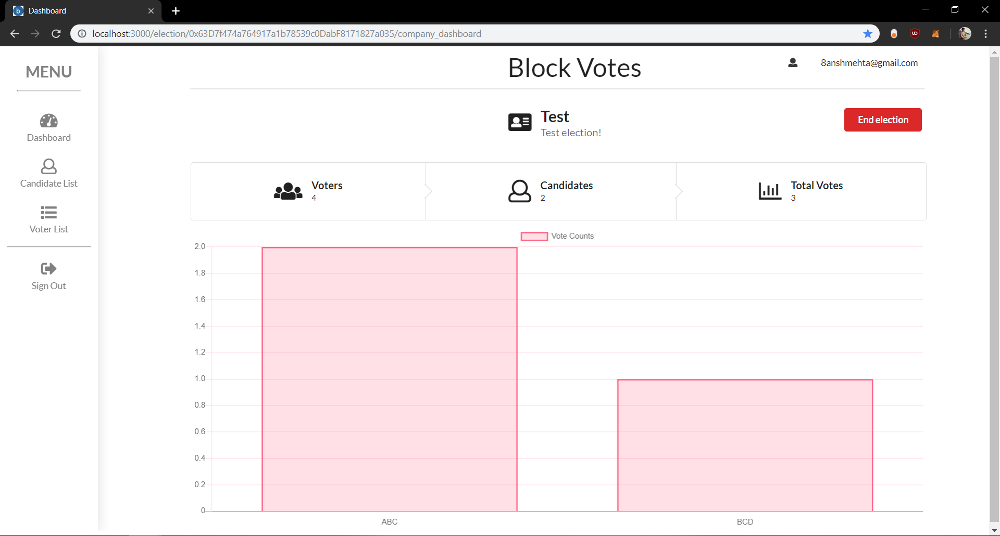
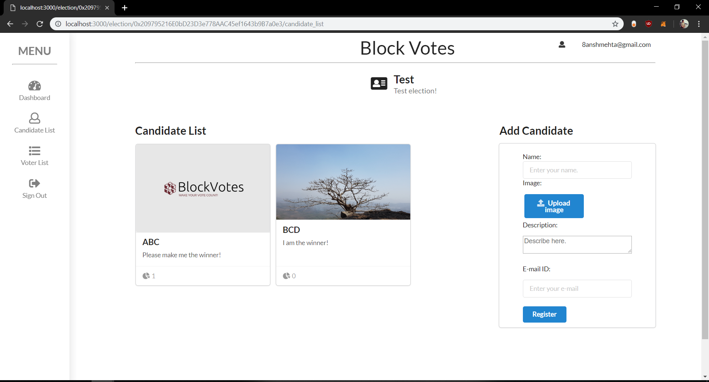
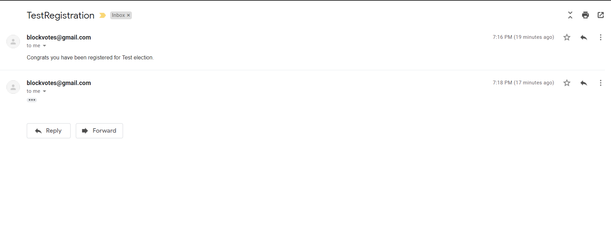
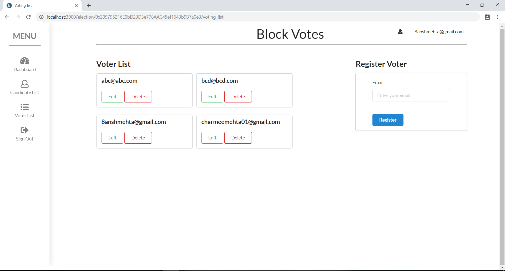
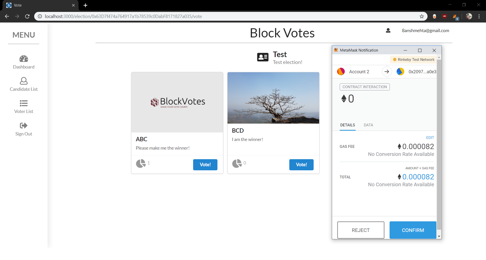

# BlockChainVoting System

A modern, secure, and user-friendly blockchain-based e-voting system built with Next.js, Ethereum, and React Bootstrap.

## 🚀 Recent Improvements

### UI/UX Enhancements
- Modernized the company dashboard with a beautiful, responsive design
- Added gradient backgrounds and smooth transitions
- Implemented card-based layouts with hover effects
- Enhanced form styling and user feedback
- Added loading states and better error handling
- Improved typography and visual hierarchy
- Added empty states for better user experience

### Technical Improvements
- Updated React and React DOM to version 16.8.0 for hooks support
- Integrated React Bootstrap for modern UI components
- Added proper error handling for MetaMask interactions
- Implemented proper gas price calculations for transactions
- Enhanced contract interaction methods with better error handling

### Dependencies Updated
- Added `react-bootstrap` and `bootstrap` for UI components
- Updated core React dependencies to compatible versions
- Configured proper peer dependencies

## 🛠 Technology Stack

- **Frontend**: Next.js, React, React Bootstrap
- **Blockchain**: Ethereum (Sepolia Testnet)
- **Smart Contracts**: Solidity
- **Web3 Integration**: Web3.js
- **Styling**: CSS-in-JS, Bootstrap

## 📋 Prerequisites

- Node.js (v12 or higher)
- MetaMask browser extension
- Sepolia testnet ETH for deploying and interacting with contracts

## 🚀 Getting Started

1. **Clone the repository**
   ```bash
   git clone [repository-url]
   cd BlockChainVoting-master
   ```

2. **Install dependencies**
   ```bash
   npm install
   ```

3. **Configure MetaMask**
   - Install MetaMask browser extension
   - Connect to Sepolia testnet
   - Get test ETH from Sepolia faucet:
     - [Alchemy Sepolia Faucet](https://sepoliafaucet.com/)
     - [Infura Sepolia Faucet](https://www.infura.io/faucet/sepolia)
     - [Chainlink Sepolia Faucet](https://faucets.chain.link/sepolia)

4. **Run the development server**
   ```bash
   npm run dev
   ```

5. **Access the application**
   Open [http://localhost:3000](http://localhost:3000) in your browser

## 🔒 Security Features

- MetaMask integration for secure wallet connection
- Smart contract-based voting system
- Proper error handling and validation
- Secure transaction handling

## 📱 Features

### Company Dashboard
- Create new elections with name and description
- View all created elections
- Monitor election status (Active/Inactive)
- Responsive design for all devices

### Election Management
- Create and manage elections
- Add candidates
- Monitor voting progress
- View election results

## 🤝 Contributing

1. Fork the repository
2. Create your feature branch (`git checkout -b feature/AmazingFeature`)
3. Commit your changes (`git commit -m 'Add some AmazingFeature'`)
4. Push to the branch (`git push origin feature/AmazingFeature`)
5. Open a Pull Request

## ⚠️ Important Notes

- Make sure to have sufficient Sepolia test ETH for contract interactions
- Keep your MetaMask wallet secure
- Don't use real ETH or deploy to mainnet without proper security audit

## 🔮 Future Improvements

- [ ] Add more interactive animations
- [ ] Implement real-time vote tracking
- [ ] Add email notifications
- [ ] Enhance mobile responsiveness
- [ ] Add more detailed analytics
- [ ] Implement multi-language support

## 📄 License

This project is licensed under the MIT License - see the LICENSE file for details.

## 🙏 Acknowledgments

- OpenZeppelin for smart contract libraries
- Ethereum community for blockchain infrastructure
- React Bootstrap team for UI components

## Build Setup

```bash
# install dependencies
npm install

# serve with hot reload at localhost:3000
npm start
```

Create your own <b>.env</b> file and the file should contain:
```bash
EMAIL=YOUR_EMAIL_ID
PASSWORD=YOUR_PASSWORD_FOR_EMAIL_ID
```
Install MetaMask extension (https://metamask.io/download.html) and make sure to have some Ether to test the application locally. Ether can be fetched from Sepolia Faucet (https://sepoliafaucet.com)

#### Note:
- Make sure to install Node.js v11.14.0 to make sure the app runs fine. Testing for other node versions is yet to be done.
- MongoDB must be working in background on localhost:27017

###### Please star the repo if it helped you in any way!

## Tech Stack:

- Solidity/Web3 (for writing/connecting the Blockchain contract)
- Next.js & Semantic UI React (front-end)
- MongoDB/ExpressJS/Node.js (back-end)
- IPFS (file storage for images)

## Screenshots of the app:

Homepage of the application:



Company registers/logs in:



Company creates an election if not created:


Dashboard on successful election creation:



List of candidates for the election (here, you can add candidates):



Candidate has been notified on the mail:



List of voters for the election (here, you can add voters):



Voters have been sent their secure usernames and passwords on the mail:


Voter login page:


Successful voting scenario:



Unsuccessful voting scenario:


Notification to each candidate and voter for the winner of candidates:


